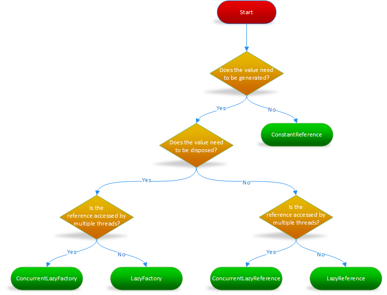

[](https://search.maven.org/search?q=g:com.github.cowwoc.pouch) [](http://cowwoc.github.io/pouch/2.1/docs/api/) [](wiki/Changelog.md)

# Pouch #

A Java library for implementing the Service Locator design pattern. ([Isn't the Service Locator an Anti-Pattern?](wiki/Frequently_Asked_Questions.md#isnt-the-service-locator-an-anti-pattern))

The goal of this library is to provide the benefits of [Inversion of Control](http://martinfowler.com/articles/injection.html) (IoC), without the downsides of Dependency Injection.

See the [FAQ](wiki/Frequently_Asked_Questions.md) for common questions.

Pouch consists of two parts:

1. A design pattern
2. A Java library for implementing the pattern

The concepts presented herein represent one possible design. They do not represent the only possible design, nor the best design for your specific situation. You are expected to evolve the examples found below to come up with your own design, using as much or as little of the code as you see fit.

# Plugin modules #

These extensions facilitate integration with 3rd-party libraries:

* [Jersey](jersey/): Integrates pouch with Jersey.
* [Dropwizard](dropwizard/): Integrates pouch with Dropwizard.

# Design pattern #

## Scopes ##

Service Locators are registries that contain one or more *values*.
Service Locators are divided into one or more *scopes*. **Scopes guarantee that values will remain unchanged during their lifetime**. For example:

```java
public interface ApplicationScope
{
	/**
	 * @return the application's license key
	 */
	String getLicenseKey();
}
```

ApplicationScope guarantees that every invocation of `ApplicationScope.getLicenseKey()` will return the same object. This allows scopes to be implemented as immutable objects (this is encouraged though it isn't required).

Scopes that need to return different values over their lifetime can return a [Builder](https://en.wikipedia.org/wiki/Builder_pattern) or [Supplier](https://docs.oracle.com/javase/8/docs/api/java/util/function/Supplier.html) that will, in turn, return different values.

## Interfaces with multiple implementations ##

Scopes are implemented in terms of interfaces with two or more implementations. If there was only one implementation, we wouldn't need inversion of control.

For example:

```java
import com.github.cowwoc.pouch.Reference;

public class MainApplicationScope implements ApplicationScope
{
	private final Reference<String> licenseKey = LazyReference.create(() -> expensiveComputation());
	
	@Override
	public String getLicenseKey()
	{
		return licenseKey.getValue();
	}
}

public class TestApplicationScope implements ApplicationScope
{
	@Override
	public String getLicenseKey()
	{
		return "invalid key";
	}
}
```

This allows developers to configure a system that behaves differently when running in production vs unit tests.

## Scope inheritance ##

Imagine we have:

* `ApplicationScope`: values specific to an application run
* `TransactionScope`: values specific to a database transaction
* `HttpScope`: values specific to an HTTP request

Notice that an `ApplicationScope` contains values whose lifetime span multiple HTTP requests. To denote this fact, we define `HttpScope` as extending
the `ApplicationScope` class. When a new `HttpScope` is constructed, we pass in the parent scope. When `HttpScope` is asked to provide a value found in
a parent scope, we simply delegate the request to the parent, as follows:

```java
public interface ApplicationScope
{
	String getLicenseKey();
}

public interface TransactionScope extends ApplicationScope
{
	Connection getConnection();
}

public interface HttpScope extends TransactionScope
{
	/**
	 * @return the URI that was requested
	 */
	URI getRequestedUri();
}

public class MainHttpScope implements HttpScope
{
	private final TransactionScope parent;
	
	public MainHttpScope(TransactionScope parent)
	{
		this.parent = parent;
	}
	
	@Override
	public Connection getConnection()
	{
		return parent.getConnection();
	}
	
	public URI getRequestedUri()
	{
		throw new UnsupportedOperationException("Will be implemented in a future release");
	}
}
```

The lifetime of child scopes must be equal to or less than the lifetime of the parent scope. This means that child scopes cannot exist without the parent. For example, the above conceptual model assumes that an `HttpScope` cannot exist without a `TransactionScope` but a `TransactionScope` may exist without an `HttpScope`. This enables a background thread to initiate a database connection without an HTTP request, but an HTTP request cannot be initiated without a database connection.

## Service provider interfaces ##

Sometimes scopes need to expose methods to other scopes, but hide them from end-users.

For example:

```java
/**
 * Methods that {@code ApplicationScope}s must implement, but are hidden from end-users.
 */
interface ApplicationScopeSpi extends ApplicationScope
{
	/**
	 * @param serviceLocator the Jersey dependency-injection mechanism
	 * @return a new HTTP scope
	 * @throws NullPointerException if {@code serviceLocator} is null
	 */
	HttpScope createHttpScope(ServiceLocator serviceLocator) throws NullPointerException;

	/**
	 * Notifies the parent that a child scope has closed.
	 * <p>
	 * @param scope the scope that was closed
	 * @throws NullPointerException  if {@code scope} is null
	 * @throws IllegalStateException if the parent scope is closed
	 */
	void onClosed(AutoCloseable scope)
		throws NullPointerException, IllegalStateException;
}
```

Now, if `ApplicationScope` implementations (e.g. `MainApplicationScope`) implement the `ApplicationScopeSpi` interface, and users code against the `ApplicationScope` interface then
`HttpScope` can invoke `ApplicationScopeSpi.onClose(AutoCloseable)` but end-users cannot see this method.

```java
abstract class AbstractHttpScope
	implements HttpScope
{
	private final ApplicationScopeSpi parent;
	
	AbstractHttpScope(ApplicationScopeSpi parent)
	{
		this.parent = parent;
	}

	@Override
	public void close() throws RuntimeException
	{
		if (closed)
			return;
		closed = true;
		try
		{
			beforeClose();
		}
		finally
		{
			parent.onClosed(this);
		}
	}
	
	/**
	 * A method that is invoked before closing the scope. Subclasses wishing to extend {@code close()}
	 * should override this method.
	 */
	protected abstract void beforeClose();
}
```

## Waiting for child scopes to shut down ##

When running in a multi-threaded environment, such as a web server, you might want to wait for ongoing HTTP requests to complete before shutting down the server. You can use the [ConcurrentChildScopes](http://cowwoc.github.io/pouch/2.1/docs/api/com/github/cowwoc/pouch/ConcurrentChildScopes.html) class to implement this as follows:

```java
abstract class AbstractApplicationScope implements ApplicationScopeSpi
{
	/**
	 * The maximum amount of time to wait for child scopes to close.
	 */
	private static final Duration SHUTDOWN_TIMEOUT = Duration.ofSeconds(10);
	protected final ConcurrentChildScopes children = new ConcurrentChildScopes();
	private final AtomicBoolean closed = new AtomicBoolean();

	@Override
	public void onClosed(AutoCloseable scope) throws NullPointerException
	{
		children.onClosed(scope);
	}

	@Override
	public boolean isClosed()
	{
		return closed.get();
	}

	@Override
	public void close()
	{
		if (!closed.compareAndSet(false, true))
			return;
		children.close(SHUTDOWN_TIMEOUT);
	}
}

public class MainApplicationScope extends AbstractApplicationScope
{
	@Override
	public TransactionScope createTransactionScope()
		throws IllegalStateException
	{
		if (isClosed())
			throw new IllegalStateException("Scope is closed");
		return children.createChildScope(() -> new MainTransactionScope(this));
	}
}
```

## Try it! ##

The [jersey plugin](jersey/src) contains a working example. Download a copy and try it for yourself.

# Class guide #



# Related projects #

* [Requirements](../../../requirements.java/): Fluent Design by Contract for Java APIs.
* [JayWire](https://github.com/vanillasource/jaywire) promises to provide the power of dependency injection without the "magic".

# License #

Licensed under the Apache License, Version 2.0: http://www.apache.org/licenses/LICENSE-2.0
